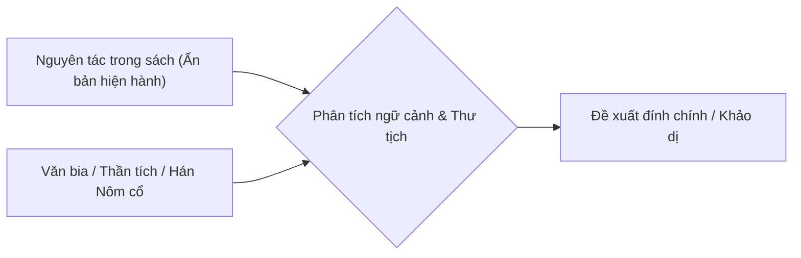

# Chuỗi Bài Khảo Cứu: "Đạo Mẫu Việt Nam"

**Tác giả chủ biên:** GS. TSKH. Ngô Đức Thịnh  
**Dự án:** Rà soát, hiệu đính và khảo sát văn bản toàn tập  
**Thực hiện:** KII  

---

## 📖 Bối Cảnh Công Trình

Bộ sách **"Đạo Mẫu Việt Nam"** do GS. TSKH. Ngô Đức Thịnh chủ biên là một trong những công trình đồ sộ, đặt nền móng lý thuyết và tư liệu dân tộc học vững chắc cho tín ngưỡng thờ Mẫu Tam phủ - Tứ phủ tại Việt Nam.

Tuy nhiên, trải qua nhiều lần tái bản, việc biên tập và chế bản ấn loát qua các thời kỳ lịch sử đã để lại một số điểm nghi vấn về:
1. **Chuyển tự Hán-Việt:** Nhầm lẫn tự dạng Hán tự tương đồng (như sai bộ thủ, lộn âm).
2. **Phiên âm thần hiệu, địa danh:** Một số tên đền, phủ, tên nhân vật lịch sử bị biến âm hoặc in sai dấu thanh.
3. **Trích dẫn thư tịch cổ:** Sự chênh lệch giữa các bản trích *Việt điện u linh tập*, *Lĩnh Nam chích quái*, các bản thần tích, văn bia đối với bản dịch trong sách.

---

## 🎯 Mục Tiêu & Phương Pháp Khảo Dị

Mỗi kỳ trong chuỗi bài viết sẽ tập trung:
- Trích xuất trực tiếp đoạn văn bản chứa nghi vấn.
- Đối chiếu song song giữa **Ấn bản hiện hành** và **Văn bản gốc / Dị bản khả tín**.
- Cung cấp nguồn thư tịch cụ thể, phân tích ngữ nghĩa và nguồn gốc tự nguyên.

---

## 📑 Danh Sách Các Kỳ

1. **[Kỳ 1: Khảo dị bài thơ chiết tự "Thiên Tiên Quỳnh Hoa" trong Vân Cát Thần Nữ](ky-01.md)**  
   *Khảo cứu về thi pháp, văn bản học và giải mã nghệ thuật chiết tự Hán tự trong giai thoại xướng họa Tây Hồ giữa Phùng Khắc Khoan và Liễu Hạnh Công Chúa.*
2. **[Kỳ 2: Khảo dị bài tán Quán Thế Âm tại Động Sơn Trang - Phủ Tây Hồ](ky-02.md)**  
   *Khôi phục bài Cử tán bát cú trong nghi thức 'Ngũ Bách Danh Quán Thế Âm' bị rơi rụng chữ, sai vần và biến dạng tự dạng trong sách.*
3. **[Kỳ 3: Khảo dị đôi câu đối Động Sơn Trang tại Phủ Tây Hồ](ky-03.md)**  
   *Từ ngộ nhận từ nguyên "Phấn đại" thành "Phần lớn" đến giải mã câu đối chữ Hán ca ngợi vẻ đẹp và uy linh của Chúa Mẫu Sơn Trang trấn giữ cõi thiêng non nước.*
4. *Kỳ 4: Đối chiếu các bản văn chầu cổ bản và hiện đại (Đang cập nhật)*
