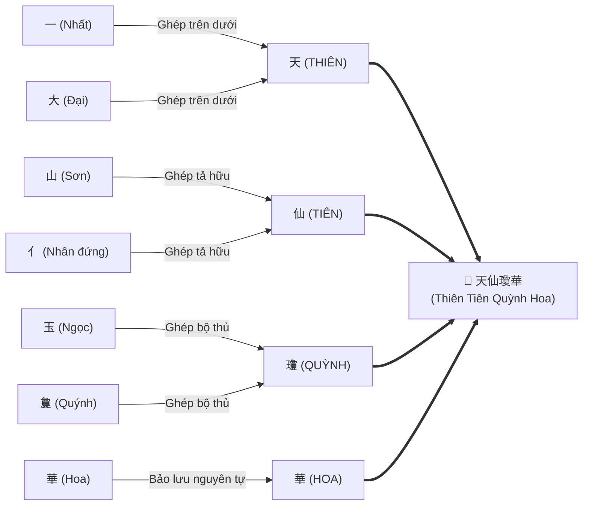

# Đọc "Đạo Mẫu Việt Nam" - Kỳ 1: Khảo dị bài thơ chiết tự "Thiên Tiên Quỳnh Hoa" trong *Vân Cát Thần Nữ*

* **Tác giả khảo cứu:** KII
* **Văn bản khảo sát:** *Đạo Mẫu Việt Nam* (Tập 1), GS. TSKH. Ngô Đức Thịnh (chủ biên), NXB Tôn giáo.
* **Đối tượng khảo sát:** Bài thơ bốn câu chữ Triện khắc trên thân cây — trích đoạn tích truyện *Vân Cát Thần Nữ* của Đoàn Thị Điểm trong *Truyền Kỳ Tân Phả*.
* **Thời gian ghi chép:** Tháng 10, 2026.

---

## 1. Dẫn Nhập & Bối Cảnh Văn Bản

Trong công trình nghiên cứu *Đạo Mẫu Việt Nam* (Tập 1), khi luận giải về nguồn gốc văn học và huyền tích dân gian của Thánh Mẫu Liễu Hạnh gắn với địa danh Thăng Long - Hồ Tây, GS. TSKH. Ngô Đức Thịnh đã dẫn lại một trích đoạn từ thiên truyện *Vân Cát Thần Nữ* (雲閤神女) trích trong tập *Truyền Kỳ Tân Phả* (傳奇新譜) của Hồng Hà nữ sĩ **Đoàn Thị Điểm** (1705–1748).

Đoạn văn thuật lại giai thoại cuộc xướng họa kỳ ngộ bên bờ Tây Hồ giữa Tam khôi danh sĩ thời Lê Trung Hưng — **Trạng Bùng Phùng Khắc Khoan** (cùng hai bạn đồng khoa Ngô Sinh và Lý Sinh) — với một thiếu nữ tuyệt sắc dựng quán bán nước dưới rặng liễu biếc. Sau cuộc thù tạc đàm đạo thi phú trác tuyệt, bẵng đi vài tháng, các danh sĩ quay lại chốn cũ tìm nàng thì cảnh vật đã đổi thay: quán nước cùng lâu đài đều biến mất, chỉ còn tiếng ve sầu râm ran trên cành biếc. Đến bên một gốc đại thụ, ba người trông thấy trên thân cây vỏ gỗ có một bài thơ tứ tuyệt viết bằng **chữ Triện** cổ kính.

Đây là một bài thơ "ẩn ngữ chiết tự" (拆字) mà thần nữ để lại nhằm giải đáp thắc mắc của thế nhân về thân phận lai lịch của mình. Khảo sát văn bản trích dẫn trong sách, có hai điểm văn bản học đáng chú ý: câu thứ hai có sự nhầm lẫn tự dạng chữ Hán trong khâu phiên âm, và câu kết chứa đựng nghệ thuật chiết tự Hán tự rất tinh tế cần được giải mã tường minh.

---

## 2. Đoạn Tuyển Trích Nguyên Bản & Chú Thích Khảo Dị

Dưới đây là nguyên văn đoạn trích trong công trình khảo cứu của GS. Ngô Đức Thịnh và phần đối chiếu khôi phục dị bản chân xác:

!!! quote "Đoạn trích trong 'Đạo Mẫu Việt Nam' (GS. Ngô Đức Thịnh, Tập 1)"
    Ba người rải chiếu ở dưới bóng cây ngồi chơi, chợt thấy thân cây có hàng chữ triện rằng:

    > Vân tác y thường phong tác xa  
    > Tiên du Đâu Xuất mộ yên hà  
    > Thế nhân dục thức ngô danh tính  
    > "Nhất đại sơn nhân ngọc Quỳnh Hoa"

    Kèm chú thích của sách: *(chữ "nhất" và chữ "đại" tức là chữ "thiên". Chữ "nhân đứng" và chữ "sơn" tức là chữ "tiên")*

    **Bản dịch nghĩa trong sách:**

    > Lấy mây làm xiêm áo, lấy gió làm xe  
    > Buổi sáng đi chơi vùng trời "Đâu Suất"  
    > Buổi chiều ngao du nơi mây khói  
    > Người đời muốn biết họ tên của ta  
    > Ta đây là người tiên trên trời tên là Quỳnh Hoa.

!!! note "Ghi chú khảo cứu văn bản (Annotation)"
    Bản in phiên âm trong sách có hai điểm cần đính chính về mặt văn bản học:

    1. **Chữ *Triêu* (朝) bị nhầm thành *Tiên* (先/仙):** Trong nguyên tác, vế đầu câu 2 là *Triêu du* (sáng đi chơi), đăng đối hoàn chỉnh với vế sau *mộ yên hà* (chiều về chốn khói mây). Chính bản dịch nghĩa trong sách đã dịch rất chuẩn xác ý tứ này (*"Buổi sáng đi chơi... Buổi chiều ngao du..."*). Do đó, chữ *"Tiên"* ở phần phiên âm nhiều khả năng là sơ suất kỹ thuật khi đánh máy hoặc chuyển tự.
    2. **Địa danh *Đâu Suất* (兜率):** Tên cõi trời trong Phật giáo là *Đâu Suất* (Tuṣita), bản in gõ nhầm thành *Đâu Xuất*.
    3. **Câu chiết tự:** Câu 4 phân tách các bộ phận cấu thành tự dạng chữ Hán, do đó cần hiểu theo dạng chiết tự là *"nhất đại sơn nhân ngọc quýnh hoa"*.

    **Bản Hán văn phục nguyên (Chữ Hán phồn thể):**
    > 雲作衣裳風作車，  
    > 朝遊兜率暮煙霞。  
    > 世人欲識吾名姓，  
    > 一大山人玉敻華。

    **Phiên âm Hán-Việt chuẩn:**
    > Vân tác y thường, phong tác xa,  
    > **Triêu** du **Đâu Suất**, mộ yên hà.  
    > Thế nhân dục thức ngô danh tính,  
    > “Nhất đại sơn nhân ngọc quýnh hoa.”

    **Dịch nghĩa:**
    > Lấy mây làm xiêm áo, lấy gió làm cộ xe,  
    > Sáng dạo chơi cõi trời Đâu Suất, chiều về chốn khói mây ráng đỏ.  
    > Người đời nếu muốn biết họ tên của ta,  
    > [Hãy ghép chữ]: “Nhất đại sơn nhân ngọc quýnh hoa.”

---

## 3. Bảng Đối Chiếu Khảo Dị Chi Tiết Bốn Câu Thơ

Đối chiếu bản phiên âm trong sách với mộc bản Hán văn của *Truyền Kỳ Tân Phả*:

| STT | Văn bản trong sách GS. Ngô Đức Thịnh | Văn bản Hán văn phục nguyên | Nhận định văn bản học & Phân tích tự dạng |
| :---: | :--- | :--- | :--- |
| **1** | Vân tác y thường phong tác xa | 雲作衣裳風作車 (*Vân tác y thường, phong tác xa*) | Câu chuẩn tắc, chỉ thiếu dấu phẩy ngắt nhịp thi pháp. |
| **2** | **Tiên** du **Đâu Xuất** mộ yên hà | 朝遊兜率暮煙霞 (***Triêu** du **Đâu Suất**, mộ yên hà*) | **Khôi phục tự dạng và phiên âm:** 1. Phục nguyên chữ **Triêu** (朝 - buổi sáng) để giữ trọn phép đối ngẫu thời gian cổ điển với **Mộ** (暮 - buổi chiều). 2. Đính chính phiên âm cõi Phật **Đâu Suất** (兜率天 - Tuṣita Heaven) thay vì *Đâu Xuất*. |
| **3** | Thế nhân dục thức ngô danh tính | 世人欲識吾名姓 (*Thế nhân dục thức ngô danh tính*) | Câu chuẩn mực cả về niêm luật và cú pháp cổ văn. |
| **4** | "Nhất đại sơn nhân ngọc Quỳnh Hoa" | 一大山人玉敻華 (*Nhất đại sơn nhân ngọc quýnh hoa*) | **Quy chuẩn chiết tự:** Chữ *Quỳnh* (瓊) được chiết tự thành bộ *Ngọc* (玉) và chữ *Quýnh* (敻). Khi đọc giải mã chiết tự nên ghi chữ thường: *nhất đại sơn nhân ngọc quýnh hoa*. |

---

## 4. Giải Mã Nghệ Thuật Chiết Tự Ở Câu Thứ Tư

Điểm tinh tế nhất của bài thơ nằm ở câu thứ tư. Đây là một câu đố chữ theo phép **Chiết tự** (拆字 — phân tích, tách ghép các bộ thủ cấu tạo nên chữ Hán):

$$\mathbf{一大山人玉敻華}$$

Khi Trạng Bùng Phùng Khắc Khoan đứng trước thân cây, ngài nhận ra câu thơ này gồm bốn cụm chiết tự tương ứng với bốn chữ trong tôn hiệu cõi tiên của thần nữ:

| Cụm từ chiết tự | Thành phần tự bộ cấu tạo | Chữ được hợp thành | Ngữ nghĩa tượng trưng |
| :---: | :--- | :---: | :--- |
| **Nhất (一) + Đại (大)** | Nét ngang chữ **Nhất** (一) đặt trên đỉnh chữ **Đại** (大 - to lớn) | **天 (THIÊN)** | Trời cao, thượng giới, cõi trời. |
| **Sơn (山) + Nhân (人 / 亻)** | Chữ **Sơn** (山 - núi non) đứng cạnh chữ **Nhân** (人, bộ nhân đứng 亻) | **仙 (TIÊN)** | Bậc tiên nhân thoát tục nơi mây ngàn non cao. |
| **Ngọc (玉) + Quýnh (敻)** | Bộ **Ngọc** (玉 / 王 - ngọc báu) ghép cùng chữ **Quýnh** (敻 - sâu xa, vời vợi) | **瓊 (QUỲNH)** | Ngọc quỳnh — thứ ngọc quý đẹp đẽ, thanh khiết. |
| **Hoa (華)** | Giữ nguyên chữ **Hoa** (華 - rực rỡ, tinh túy) | **華 (HOA)** | Hoa cỏ rực rỡ, dung mạo thanh cao. |

$$\Longrightarrow \text{Bốn chữ chiết tự hợp thành: } \mathbf{天 仙 瓊 華} \text{ (THIÊN TIÊN QUỲNH HOA)}$$

Danh hiệu **Thiên Tiên Quỳnh Hoa** (天仙瓊華) chính là tiền thân của Thánh Mẫu Liễu Hạnh trên thiên giới — Đệ Nhị Cung Phi chốn tiên đình vì lỡ tay đánh rơi chén ngọc mà phải trích giáng trần gian. Hiểu được câu đố chữ tao nhã này, Phùng Khắc Khoan mỉm cười bái tạ, biết rằng mình vừa tao ngộ bậc tiên thánh giáng thế.

---

## 5. Phân Tích Văn Bản Học & Điển Cố

### 5.1. Về cặp đối ngẫu *Triêu* (朝) — *Mộ* (暮)

Trong thi pháp chữ Hán cổ điển, cấu trúc thời gian **Triêu** (buổi sáng) và **Mộ** (buổi chiều) là một môtíp đối ngẫu đăng đối rất phổ biến:

$$\text{Triêu du (朝遊) } \longleftrightarrow \text{ Mộ yên hà (暮煙霞)}$$

Ngay trong bản dịch nghĩa của sách *Đạo Mẫu Việt Nam*, dịch giả đã chuyển ngữ rất sát nghĩa: *"Buổi sáng đi chơi vùng trời Đâu Suất / Buổi chiều ngao du nơi mây khói"*. Điều này khẳng định trong nguyên bản Hán văn của dịch giả vốn có chữ *Triêu* (朝). Chữ *Tiên* trong dòng phiên âm chỉ là một sự nhầm lẫn kỹ thuật in ấn, cần được trả về đúng tự dạng *Triêu du Đâu Suất*.

### 5.2. Điển cố cõi Phật "Đâu Suất" (兜率) và không gian Đạo giáo "Yên hà" (煙霞)

Hai câu thơ đầu phản ánh sự **dung hợp Tam giáo (Phật - Đạo)** tự nhiên trong tâm thức của tác giả Đoàn Thị Điểm:

* **Đâu Suất (兜率天, *Tuṣita*):** Tầng trời thứ tư trong Lục Dục Thiên theo vũ trụ luận Phật giáo — nơi Bồ Tát Di Lặc (Maitreya) an trú thuyết pháp. Việc Quỳnh Hoa tiên nữ "sáng dạo Đâu Suất" gắn liền hình tượng Mẫu với cõi Phật thanh tịnh.
* **Yên hà (煙霞):** Điển ngữ quen thuộc của Đạo giáo thần tiên chỉ chốn mây ráng non bồng, nơi các bậc chân nhân quy ẩn tiêu dao.
* **Vân tác y thường, phong tác xa (雲作衣裳風作車):** Hình tượng mượn mây làm áo, cưỡi gió làm xe bắt nguồn từ thi ca thần tiên cổ điển (như *Ly Tao* của Khuất Nguyên).

Sự kết hợp giữa cõi Phật *Đâu Suất* và cảnh tiên *Yên hà* thể hiện một nét đặc trưng lớn của tín ngưỡng thờ Mẫu Việt Nam: dung nhiếp cả yếu tố Phật gia lẫn Đạo giáo thần tiên vào lòng tín ngưỡng bản địa.

### 5.3. Thần nữ văn học — Nét đẹp độc đáo của Thánh Mẫu Liễu Hạnh

Thánh Mẫu Liễu Hạnh qua tác phẩm *Vân Cát Thần Nữ* hiện lên với cốt cách của một **nữ thần văn chương**:

* Nàng mở quán bên Hồ Tây không phải để mưu sinh, mà để chọn bạn tri âm, đàm đạo thi phú với các danh sĩ hàng đầu như Phùng Khắc Khoan.
* Trước khi trở về cõi tiên, nàng lưu lại danh tính bằng một bài thơ chữ Triện khắc trên thân cây kèm nghệ thuật chiết tự Hán tự kín đáo. Lối xưng danh bằng ẩn ngữ này vừa thể hiện phong thái thanh cao, vừa là một thử thách tao nhã dành cho tao nhân mặc khách.

---

## 6. Ý Nghĩa Trong Hệ Thống Thần Phả Đạo Mẫu

Trong hệ thống thần tích và ngọc phả tại Phủ Dầy (Nam Định), Đền Sòng (Thanh Hóa) và Phủ Tây Hồ (Hà Nội), tôn hiệu **Thiên Tiên Quỳnh Hoa** đánh dấu tiền kiếp thượng giới của Thánh Mẫu:

1. **Tiền kiếp cõi trời:** Quỳnh Hoa công chúa.
2. **Giáng sinh lần thứ nhất:** Đầu thai vào nhà họ Lê tại làng Vân Cát (Nam Định), mang tên Lê Thị Thắng (Giáng Tiên).
3. **Giáng sinh lần thứ hai & thứ ba:** Tái hiện tại Tây Hồ (xướng họa cùng Phùng Khắc Khoan), hiển thánh tại Phố Cát, Sòng Sơn cứu trợ nhân dân.

Bài thơ chiết tự khắc trên cây bên bờ Tây Hồ là một gạch nối văn học tuyệt đẹp giữa thần tích tôn giáo dân gian và tác phẩm truyền kỳ chữ Hán thời trung đại.

---

## 7. Kết Luận

Bài thơ bốn câu khắc trên thân cây trong *Vân Cát Thần Nữ* là một thi phẩm nhỏ nhắn nhưng hàm súc về thi pháp và điển cố. Việc đính chính chữ *Triêu* thay cho chữ *Tiên* (do lỗi ấn loát trong bản phiên âm) và phân tích tường minh bốn cụm chiết tự *nhất đại sơn nhân ngọc quýnh hoa* giúp độc giả khi đọc tác phẩm *Đạo Mẫu Việt Nam* nắm bắt trọn vẹn vẻ đẹp nguyên tác: một bức tranh tiên cảnh tự do phiêu diêu giữa cõi Phật và cõi tiên, cùng lời xưng danh ẩn ngữ đầy tài hoa của Thiên Tiên Quỳnh Hoa.

---

## 8. Thư Mục Tham Khảo Học Thuật

1. **Ngô Đức Thịnh (chủ biên)** (2010), *Đạo Mẫu Việt Nam* (Tập 1 & 2), Nhà xuất bản Tôn giáo, Hà Nội.
2. **Đoàn Thị Điểm** (thế kỷ XVIII), *Truyền Kỳ Tân Phả* (傳奇新譜), Bản khắc in chữ Hán (Ký hiệu A.1105, Viện Nghiên cứu Hán Nôm, Hà Nội).
3. **Đinh Gia Khánh, Bùi Duy Tân, Mai Cao Chương** (1998), *Văn học Việt Nam (thế kỷ X - nửa đầu thế kỷ XVIII)*, Nhà xuất bản Giáo dục, Hà Nội.
4. **Viện Nghiên cứu Hán Nôm** (1993), *Tuyển tập truyện ký Việt Nam thời trung đại* (Tập 2: Truyền Kỳ Tân Phả), Nhà xuất bản Khoa học Xã hội, Hà Nội.
5. **Thiều Chửu Nguyễn Hữu Kha** (1942), *Hán-Việt Tự Điển*, Nhà xuất bản Đuốc Tuệ (tái bản Nhà xuất bản Văn hóa Thông tin).
6. **Đào Duy Anh** (1932), *Hán-Việt Từ Điển*, Quan Hải Tùng Thư (tái bản Nhà xuất bản Khoa học Xã hội).
7. **Nhiều tác giả** (2002), *Hồ Tây - Lịch sử, văn hóa, danh thắng*, Nhà xuất bản Hà Nội.
