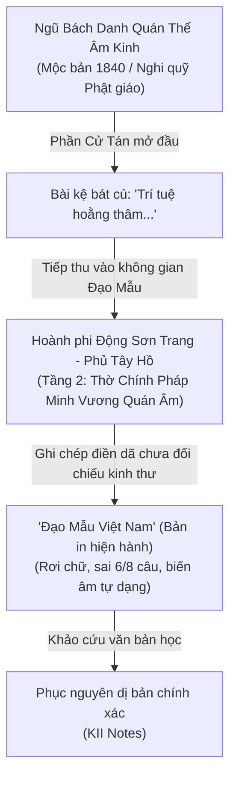

# Đọc "Đạo Mẫu Việt Nam" - Kỳ 2: Khảo dị bài tán Quán Thế Âm tại Động Sơn Trang (Phủ Tây Hồ)

* **Tác giả khảo cứu:** KII
* **Văn bản khảo sát:** *Đạo Mẫu Việt Nam* (Tập 1), GS. TSKH. Ngô Đức Thịnh (chủ biên), NXB Tôn giáo.
* **Đối tượng khảo sát:** Văn bản bức hoành phi tại Động Sơn Trang — Phủ Tây Hồ (Hà Nội).
* **Thời gian ghi chép:** Tháng 10, 2026.

---

## 1. Dẫn Nhập & Trích Tuyển Văn Bản

Trong công trình khảo sát điền dã di tích Phủ Tây Hồ (Hà Nội) thuộc tác phẩm *Đạo Mẫu Việt Nam*, cố Giáo sư Ngô Đức Thịnh đã miêu tả chi tiết cấu trúc kiến trúc Động Sơn Trang — một công trình phối thờ đặc trưng trong các đền, phủ thờ Mẫu miền Bắc. Tại tầng hai của động, sách ghi lại bài thơ khắc trên bức hoành phi treo ở cung giữa.

Tuy nhiên, qua đối chiếu văn bản học, bản ghi âm chữ Quốc ngữ trong công trình xuất hiện nhiều sai sót nghiêm trọng: rơi rụng chữ làm biến thể câu thất ngôn thành lục ngôn, nhầm lẫn tự dạng Hán tự cơ bản, phá vỡ niêm luật bằng trắc và làm sai lệch ý nghĩa Phật học.

Dưới đây là đoạn trích nguyên văn từ sách và phần chú thích khảo cứu đã được phát hiện và đính chính.

---

## 2. Đoạn Tuyển Trích Nguyên Bản & Chú Thích Khảo Dị

!!! quote "Đoạn trích trong 'Đạo Mẫu Việt Nam' (GS. Ngô Đức Thịnh)"
    Bên trên cung giữa tầng hai là bức hoành phi có khắc:

    > “Trí tuệ hoằng thâm tại biến tài  
    > Đoan ba thượng tuyệt trần ai  
    > Tường quang thước phá thiên sinh  
    > Cam lệ năng khuynh vạn kiếp lai  
    > Thúy liễu phất khai kim thế giới  
    > Hồng liên dũng xuất ngọc lại đài  
    > Ngã kim thuế thủ phần hương tán  
    > Nguyệt hướng nhân gian ứng hiện lai”
!!! note "Ghi chú khảo cứu phát hiện sai sót (Annotation)"
    Bài thơ bị thiếu chữ và chép sai chữ nghiêm trọng, dù có thể phản ánh sự ghi chép trung thực lại một bức hoành phi đã bị khắc sai tại hiện trường hoặc do lỗi đánh máy/chế bản.

    Bản phục nguyên đầy đủ dựa trên kinh bản Phật giáo Hán Nôm cổ như sau:

    **Bản Hán văn (Chữ Hán phồn thể):**
    > 智慧弘深大辨才  
    > 端居波上絕塵埃  
    > 祥光爍破千生病  
    > 甘露能傾萬劫災  
    > 翠柳拂開金世界  
    > 紅蓮涌出玉樓臺  
    > 我今稽首焚香讚  
    > 願向人間應現來

    **Phiên âm Hán-Việt chuẩn:**
    > Trí tuệ hoằng thâm **đại biện** tài,  
    > **Đoan cư** ba thượng tuyệt trần ai.  
    > Tường quang thước phá thiên sinh **bệnh**,  
    > Cam **lộ** năng khuynh vạn kiếp **tai**.  
    > Thúy liễu phất khai kim thế giới,  
    > Hồng liên dũng xuất ngọc **lâu** đài.  
    > Ngã kim **khể** thủ phần hương tán,  
    > **Nguyện** hướng nhân gian ứng hiện lai.

    **Dịch nghĩa:**

    > Trí tuệ sâu rộng, tài biện thuyết lớn lao,  
    > Ngài an nhiên ngự trên sóng nước, tuyệt sạch bụi trần.  
    > Ánh sáng lành chói rực, phá tan bệnh khổ trải nghìn đời,  
    > Nước cam lộ có thể dập trừ tai ách muôn kiếp.  
    > Cành liễu biếc phất mở cõi thế giới vàng,  
    > Sen đỏ vọt nở đài ngọc tôn nghiêm.  
    > Nay con cúi đầu đảnh lễ, đốt hương mà ca ngợi,  
    > Nguyện Ngài lại hiện đến cõi nhân gian cứu độ.
---

## 3. Bảng Đối Chiếu Khảo Dị Chi Tiết 8 Câu Thơ

Bài thơ là một bài thất ngôn bát cú chuẩn mực. Khi đặt bản in trong sách cạnh bản nguyên gốc của nghi quỹ Phật giáo, sự sai lệch hiển lộ rất rõ ràng:

| STT | Nguyên tác trong sách | Văn bản phục nguyên | Lỗi văn bản & Phân tích |
| :---: | :--- | :--- | :--- |
| **1** | Trí tuệ hoằng thâm **tại biến** tài | 智慧弘深**大辨**才 (...**đại biện** tài) | Nhầm **đại biện** (大辨 / 大辯 - tài biện thuyết siêu phàm) thành *tại biến* (在變). |
| **2** | **Đoan ba** thượng tuyệt trần ai *(6 chữ)* | **端居**波上絕塵埃 (**Đoan cư** ba...) | **Rơi rụng chữ:** Thiếu chữ **cư** (居 - an tọa, ngự yên). Câu thất ngôn biến thành 6 chữ. |
| **3** | Tường quang thước phá **thiên sinh** *(6 chữ)* | 祥光爍破千生**病** (...thiên sinh **bệnh**) | **Rơi rụng chữ:** Thiếu chữ **bệnh** (病 - bệnh tật, não khổ). Câu thất ngôn biến thành 6 chữ. |
| **4** | Cam **lệ** năng khuynh vạn kiếp **lai** | 甘**露**能傾萬劫**災** (Cam **lộ** ... vạn kiếp **tai**) | **Sai 2 chữ then chốt:** 1. *Cam lộ* (甘露 - sương ngọt cứu độ) nhầm thành *cam lệ* (甘淚 - nước mắt ngọt?). 2. *Vạn kiếp tai* (萬劫災 - tai kiếp) nhầm thành *vạn kiếp lai*. Phá vỡ vần chính của bài thơ (vần *tài - ai - tai - đài - lai*), lặp vần với câu 8. |
| **5** | Thúy liễu phất khai kim thế giới | 翠柳拂開金世界 | Câu đúng trọn vẹn cả thanh luật và ý nghĩa. |
| **6** | Hồng liên dũng xuất ngọc **lại** đài | 紅蓮涌出玉**樓**臺 (...ngọc **lâu** đài) | Nhầm chữ **lâu** (樓 - lầu gác/lâu đài) thành *lại* (bộ Mộc bị chép lộn). |
| **7** | Ngã kim **thuế** thủ phần hương tán | 我今**稽**首焚香讚 (...**khể** thủ...) | **Nhầm lẫn điển cố:** Chữ **khể** (稽) trong *khể thủ* (cúi đầu sát đất đảnh lễ) nhầm thành chữ *thuế* (稅 - tiền thuế) do hai tự dạng gần giống nhau ở tự bộ. |
| **8** | **Nguyệt** hướng nhân gian ứng hiện lai | **願**向人間應現來 (**Nguyện** hướng...) | Nhầm chữ **Nguyện** (願 - phát nguyện, mong cầu) thành *Nguyệt* (月 - vầng trăng). Làm mất chủ ngữ và tâm nguyện chí thành của người hành lễ. |

---

## 4. Phân Tích Văn Bản Học & Ngữ Nghĩa Phật Học

### 4.1. Lỗi cấu trúc thi pháp và sự suy thoái văn bản điền dã

    Trong thi pháp chữ Hán, thể thơ thất ngôn bát cú quy định nghiêm ngặt về số lượng âm tiết (mỗi câu 7 chữ) và luật hiệp vần:

    * Tại câu 2 và câu 3 của bản in, việc thiếu chữ (*"Đoan ba thượng..."* và *"thiên sinh"*) làm gãy nhịp ngắt $4/3$ truyền thống, biến câu thơ thành thể lục ngôn bất thường giữa một chỉnh thể bát cú.
    * Về vần luật: Bài thơ hiệp theo bộ vần **Tai / Hôi** (Bình thanh): **Tài** (才) — **Ai** (埃) — **Tai** (災) — **Đài** (臺) — **Lai** (來). Việc câu 4 đổi chữ **Tai** (災 - tai họa) thành **Lai** (來) không chỉ lặp lại chữ cuối cùng của câu thứ 8 mà còn phá vỡ quy tắc "bất trùng vận" trong thơ cổ điển.

### 4.2. Khôi phục ý nghĩa các danh từ và điển cố Phật giáo

1. **Khể thủ (稽首) đối với Thuế thủ (稅首):**

    *Khể thủ* là nghi thức lễ kính cao nhất trong Phật giáo cổ truyền (đầu chạm đất, hai tay nâng gót chân Phật). Tự dạng chữ *Khể* (稽 - gồm bộ Hòa, Khảo, Thao) rất dễ bị người sao chép sơ ý hoặc người thợ khắc gỗ thiếu học vấn đọc nhầm sang chữ *Thuế* (稅 - gồm bộ Hòa và Đoái). Việc đọc thành "thuế thủ" trở thành một cụm từ tối nghĩa, vô lý trong văn cảnh tụng niệm.

2. **Cam lộ (甘露) đối với Cam lệ (甘淚):**

    Trong biểu tượng học Quán Âm, tay Bồ Tát cầm cành dương liễu nhúng vào bình tịnh thủy rưới nước *Cam lộ* (Amrita) giải thoát lửa thiêu phiền não cho chúng sinh khắp mười phương. Bản in ghi "cam lệ" là một lỗi sai do phát âm địa phương hoặc đánh máy, làm biến tướng một pháp khí biểu tượng tôn giáo.

3. **Cặp câu đối ứng (Thực đối):**

    Hai câu 3 và 4 tạo thành một liên đối hoàn mỹ về cả nghĩa và thanh:

    $$\begin{matrix}
    \text{Tường quang thước phá} & \longleftrightarrow & \text{Cam lộ năng khuynh} \\
    \text{thiên sinh bệnh} & \longleftrightarrow & \text{vạn kiếp tai}
    \end{matrix}$$

    "thiên sinh bệnh" (bệnh tật trong nghìn đời) đối trọn vẹn với "vạn kiếp tai" (tai ách trong muôn kiếp). Đèn trí huệ xua tan bệnh khổ; nước cam lộ dập tắt tai ương. Khi bản in làm mất chữ *bệnh* và đổi *tai* thành *lai*, phép đối ngẫu danh tác này hoàn toàn sụp đổ.

---

## 5. Truy Tìm Căn Cước Nguồn Gốc Thư Tịch

Bài thơ khắc trên bức hoành phi này hoàn toàn không phải một sáng tác dân gian địa phương của văn nhân vùng Tây Hồ, mà có xuất xứ từ một pho nghi quỹ cổ rất thịnh hành trong các chốn tùng lâm miền Bắc:

!!! tip "Nguồn gốc: Nghi thức Lễ Ngũ Bách Danh Quán Thế Âm"
    Văn bản này chính là bài **Cử tán (舉讚)** — tức bài kệ xướng tán mở đầu trước khi hành lễ trong nghi thức **Lễ Ngũ Bách Danh Quán Thế Âm Nghi** (禮五百觀世音名儀), thường gọi tắt là **Ngũ Bách Danh Quán Thế Âm Kinh** (五百名觀世音經).

    **Niên đại thư tịch:** Bản mộc bản khắc in bằng chữ Hán lưu trữ sớm nhất hiện nay được ghi nhận có niên hiệu **Minh Mạng thứ 21 (1840)**. Tuy nhiên, các khảo cứu văn bia và phả lục cho thấy nghi lễ bái sám ngũ bách danh Quán Âm đã được truyền tụng sâu rộng trong giới Phật tử Đại Việt từ trước năm 1797.

    **Chức năng phụng tự:** Khóa lễ này tán thán đại bi tâm của Quán Thế Âm, xưng tụng 500 hồng danh gắn với các hạnh nguyện cứu khổ, tầm thanh cứu nạn. Bài kệ 8 câu này được xướng tụng để dâng hương (phần hương), triệu thỉnh thần thông của Ngài giáng đàn chứng minh.

---

## 6. Ý Nghĩa Trong Không Gian Tín Ngưỡng Phủ Tây Hồ

Việc một bài kệ tán Quán Thế Âm Bồ Tát xuất hiện ngay tại bức hoành phi trung tâm tầng hai của **Động Sơn Trang** tại Phủ Tây Hồ mang ý nghĩa văn hóa và nhân học tôn giáo đặc biệt sâu sắc:

1. **Hiện tượng "Tiền Phật Hậu Mẫu" và "Phật Mẫu đồng nguyên":**
    Trong hệ thống thờ tự Đạo Mẫu Tứ phủ, Đức Phật (đặc biệt là Quán Thế Âm Bồ Tát với danh hiệu *Chính Pháp Minh Vương Bồ Tát*) luôn được tôn trí ở vị trí tối thượng: ngự trên đỉnh Động Sơn Trang hoặc có ban thờ riêng ở thượng tầng. Các vị Thánh Mẫu, Chầu Bà, Cô Sơn Trang đều quy y Tam Bảo và thừa hành Phật sự cứu độ muôn dân.
2. **Cảnh báo về chất lượng tư liệu điền dã dân tộc học:**
    Trường hợp này là lời nhắc nhở đối với giới nghiên cứu văn hóa dân gian: Khi sao chép hoành phi, câu đối tại các di tích hỗn dung tín ngưỡng (Đền - Phủ - Chùa), không thể chỉ nhìn mặt chữ phiên âm cảm tính mà bắt buộc phải đối chiếu với kho tàng thư tịch Phật giáo và Đạo giáo Hán Nôm kinh điển để tránh lưu hành những văn bản tam sao thất bản.

---

## 7. Kết Luận

Việc phát hiện, khảo dị và phục nguyên bài cử tán Quán Thế Âm tại Phủ Tây Hồ đã trả lại diện mạo nguyên bản, chỉnh chu cho một tuyệt tác thi kệ tôn giáo cổ truyền. Đây là cứ liệu văn bản học xác thực, giúp độc giả khi đọc tác phẩm của GS. Ngô Đức Thịnh có cái nhìn chuẩn xác hơn về sự hòa quyện giữa Phật giáo và tín ngưỡng thờ Mẫu Việt Nam.

## 8. Thư Mục Tham Khảo Học Thuật

1. **Ngô Đức Thịnh (chủ biên)** (2010), *Đạo Mẫu Việt Nam* (Tập 1 & 2), Nhà xuất bản Tôn giáo, Hà Nội.
2. **Sa môn Thích Viên Thành** (khảo đính) (2000), *Lễ Ngũ Bách Danh Quán Thế Âm Bồ Tát Nghi* (禮五百名觀世音菩薩儀), Mộc bản khắc in năm Minh Mạng thứ 21 (1840), Chùa Hương Tích tùng lâm tàng bản.
3. **Thích Tiến Đạt** (2008), *Nghi thức gia trì và khoa cúng Phật giáo miền Bắc*, Nhà xuất bản Tôn giáo, Hà Nội.
4. **Viện Nghiên cứu Hán Nôm** (2007), *Tuyển tập Văn bia Hà Nội* (Tập 2: Văn bia vùng Tây Hồ - Từ Liêm), Nhà xuất bản Hà Nội.
5. **Nhiều tác giả** (2002), *Hồ Tây - Lịch sử, văn hóa, danh thắng*, Nhà xuất bản Hà Nội.
