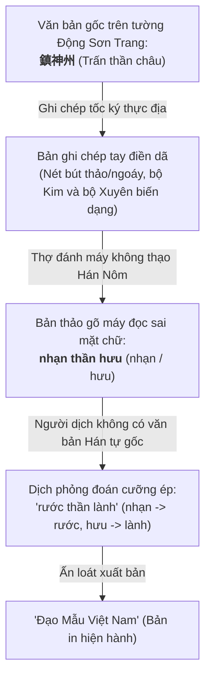

# Đọc "Đạo Mẫu Việt Nam" - Kỳ 3: Khảo dị đôi câu đối Động Sơn Trang (Phủ Tây Hồ)

* **Tác giả khảo cứu:** KII
* **Văn bản khảo sát:** *Đạo Mẫu Việt Nam* (Tập 1), GS. TSKH. Ngô Đức Thịnh (chủ biên), NXB Tôn giáo.
* **Đối tượng khảo sát:** Đôi câu đối chữ Hán trên hai bên tường Động Sơn Trang — Phủ Tây Hồ (Hà Nội).
* **Thời gian ghi chép:** Tháng 10, 2026.

---

## 1. Dẫn Nhập & Bối Cảnh Khảo Sát

Trong công trình nghiên cứu điền dã *Đạo Mẫu Việt Nam* (Tập 1), sau khi ghi chép bài hoành phi thờ Quán Thế Âm Bồ Tát ở tầng hai Động Sơn Trang tại Phủ Tây Hồ (đã được khảo dị và phục nguyên ở [Kỳ 2](ky-02.md)), cố Giáo sư Ngô Đức Thịnh tiếp tục ghi nhận đôi câu đối bằng chữ Hán đắp trên hai bên tường của động.

Tuy nhiên, khảo sát kỹ văn bản in trong sách cho thấy một hiện tượng "tam sao thất bản" vô cùng kỳ lạ và trầm trọng:
1. Bản phiên âm chữ Quốc ngữ bị chép sai tự dạng nghiêm trọng ở vế thứ hai, biến cụm từ Hán văn tôn nghiêm thành những từ ngữ vô nghĩa.
2. Bản dịch nghĩa tiếng Việt rơi vào bẫy ngộ nhận từ nguyên sơ đẳng, biến mỹ từ cổ điển chỉ người đẹp, nữ thần thành một cụm từ phàm tục ngô nghê (*"Phần lớn"*).

Hiện tượng này phản ánh một lỗ hổng kinh điển trong công tác thu thập tư liệu điền dã Hán Nôm: khi người ghi chép thực địa chép tay vội vã hoặc người chế bản gõ phím nhìn chữ đoán mò, sau đó người dịch lại dịch đuổi theo âm Quốc ngữ méo mó mà không hoàn nguyên văn bản chữ Hán. Dưới đây là khảo sát chi tiết và bản phục nguyên hoàn chỉnh cho di sản văn khắc này.

---

## 2. Tuyển Trích Nguyên Văn Trong Sách & Bản Phục Nguyên

!!! quote "Đoạn trích trong 'Đạo Mẫu Việt Nam' (GS. Ngô Đức Thịnh, Tập 1)"
    Hai bên tường trong Động có thêm câu đối nữa:

    > Phấn đại bách niên lưu nữ sử  
    > Anh linh thiên cổ nhạn thần hưu

    **Dịch:**

    > Phần lớn trăm năm ghi nữ sử  
    > Ngày xưa anh linh rước thần lành

!!! note "Ghi chú khảo cứu văn bản (Annotation)"
    Văn bản trong ấn bản hiện hành xuất hiện hai tầng sai lệch:
    
    1. **Tầng 1 (Vế trên):** Phiên âm đúng âm đọc (*Phấn đại*), nhưng bản dịch lại dịch thành *"Phần lớn"*. Đây là lỗi nhầm lẫn tự nguyên tai hại giữa chữ **Đại** (黛 - thuốc kẻ lông mày) trong cụm từ **Phấn đại** (粉黛) với chữ **Đại** (大 - to lớn), rồi cưỡng âm chữ *Phấn* thành *Phần*.
    2. **Tầng 2 (Vế dưới):** Phiên âm bị thoái hóa dạng chữ từ **Trấn thần châu** (鎮神州) thành **nhạn thần hưu** (雁神休?). Dẫn đến người dịch phỏng đoán theo âm sai thành *"rước thần lành"* hoàn toàn xa lạ với văn bản gốc.

    Dưới đây là nguyên bản chữ Hán chân xác tại thực địa di tích Phủ Tây Hồ và bản phiên âm, dịch nghĩa chuẩn:

    **Bản Hán văn chân xác:**
    > 粉黛百年流女史，  
    > 英靈千古鎮神州。

    **Phiên âm Hán-Việt chuẩn:**
    > Phấn đại bách niên lưu nữ sử,  
    > Anh linh thiên cổ trấn thần châu.

    **Dịch nghĩa sát văn cảnh:**
    > Son phấn trăm năm lưu truyền trong nữ sử,  
    > Anh linh muôn thuở trấn giữ cõi thiêng non nước.

    **Bản dịch thơ đối ngẫu:**
    > Son phấn trăm năm lưu sử nữ,  
    > Anh linh nghìn thuở giữ dòng thiêng.

---

## 3. Bảng Đối Chiếu Khảo Dị Chi Tiết Từng Vế Câu Đối

Để thấy rõ cơ chế sai lệch văn bản, chúng ta đặt nguyên bản chữ Hán đối sánh trực tiếp với bản in trong sách:

| Thành phần câu đối | Chữ Hán nguyên bản | Phiên âm trong sách | Dịch nghĩa trong sách | Phân tích & Đính chính văn bản |
| :--- | :--- | :--- | :--- | :--- |
| **Vế 1 (Vế xuất)** | **粉黛** (Phấn đại) | Phấn đại | **Phần lớn** | **Ngộ nhận từ nguyên:** Nhầm *Đại* (黛 - kẻ mày) thành *Đại* (大 - to). *Phấn đại* là hoán dụ chỉ nữ thần, người đẹp; hoàn toàn không có nghĩa là "phần lớn". |
| | **百年** (Bách niên) | bách niên | trăm năm | Đúng. Chỉ thời gian dài lâu, một đời người hoặc trăm năm lịch sử. |
| | **流** (Lưu) | lưu | ghi | Chữ **Lưu** (流) nghĩa là lưu truyền, truyền lại đời sau (như *lưu danh*, *lưu truyền*), không đồng nhất với chữ *Lưu* (留 - giữ lại) hay chữ *Ký* (記 - ghi chép). |
| | **女史** (Nữ sử) | nữ sử | nữ sử | Khái niệm chỉ sử sách chép về nữ giới, liệt nữ, hoặc tôn xưng các bậc nữ thần có công tích hiển hách. |
| **Vế 2 (Vế đối)** | **英靈** (Anh linh) | Anh linh | Ngày xưa anh linh | Bản dịch chắp thêm hai chữ *"Ngày xưa"* vào đầu câu làm gãy nhịp đối; chữ *Linh* (靈) ở đây chỉ uy linh, linh ứng của Thánh Mẫu. |
| | **千古** (Thiên cổ) | thiên cổ | *(bị gộp nghĩa)* | Nghĩa đen là nghìn đời, muôn thuở; đối xứng tuyệt hảo với *Bách niên* (trăm năm). |
| | **鎮** (Trấn) | **nhạn** | **rước** | **Lỗi tự dạng điền dã:** Chữ **Trấn** (鎮 - trấn giữ, bảo hộ) bị đọc lộn thành chữ *Nhạn* (雁 - chim nhạn), sau đó bản dịch đoán mò thành chữ *rước* (!). |
| | **神州** (Thần châu) | **thần hưu** | **thần lành** | **Lỗi chuyển tự & dịch cưỡng cầu:** Chữ **Châu** (州 - cõi đất, miền đất) bị đọc thành chữ *Hưu* (休 - nghỉ ngơi, tốt lành), rồi dịch thành *thần lành* vô nghĩa. Nguyên gốc là **Thần châu** (cõi đất thiêng). |

---

## 4. Phân Tích Văn Bản Học & Từ Nguyên Học

### 4.1. Giải phẫu sự ngộ nhận từ nguyên: Từ "Phấn đại" đến "Phần lớn"

Sai lầm khôi hài nhất trong đoạn văn là việc dịch cụm từ **Phấn đại (粉黛)** thành **"Phần lớn"**.

1. **Từ nguyên của "Phấn đại":**
   * **Phấn (粉):** Gồm bộ *Mễ* (米) và chữ *Phân* (分). Vốn là bột gạo xay mịn dùng để trang điểm thoa mặt thời xưa; nghĩa rộng là son phấn, trang sức của phái nữ.
   * **Đại (黛):** Gồm bộ *Hắc* (黑 - màu đen) phối với chữ *Đại* (代). Đây là loại khoáng thạch màu xanh đen thời cổ phụ nữ dùng để mài vẽ lông mày (*họa mi*).
   * **Phấn đại (粉黛):** Từ ghép đẳng lập biểu trưng cho việc trang điểm của phụ nữ. Trong thi pháp cổ điển Á Đông, đây là biện pháp tu từ hoán dụ (metonymy) kinh điển để chỉ phụ nữ, trang tuyệt sắc hoặc chốn khuê các, tương tự như các từ *hồng nhan* (紅顏), *quần thoa* (裙釵).
   * Điển cố tiêu biểu nhất trong thi ca Đường thi chính là tuyệt tác *Trường Hận Ca* của Bạch Cư Dị:
     > 回眸一笑百媚生，  
     > 六宮**粉黛**無顏色。  
     *(Hồi mâu nhất tiếu bách mị sinh,  
     Lục cung **phấn đại** vô nhan sắc.)*  
     *(Liếc mắt mỉm cười trăm vẻ tươi duyên,  
     Khiến son phấn sáu cung đều trở nên nhạt nhòa mất sắc).*
2. **Căn nguyên của lỗi biên dịch:**
   * Người dịch bản in do không đối chiếu trực tiếp mặt chữ Hán trên tường động mà chỉ nhìn vào phiên âm Quốc ngữ *"Phấn đại"*.
   * Do phản xạ âm thanh hiện đại, người dịch liên tưởng âm *Đại* với chữ *Đại* (大 - to lớn), rồi phỏng đoán âm *Phấn* thành chữ *Phần* (phần chia, bộ phận). Từ đó ghép thành cụm từ *"Phần lớn"*.
   * Lối dịch này biến một câu ca ngợi nhan sắc thanh tú và công đức của các nữ thần miền sơn cước thành một phát ngôn hành chính khô khan, ngô nghê và phá hỏng hoàn toàn không gian linh thiêng của Động Sơn Trang.

### 4.2. Cơ chế suy thoái tự dạng: Từ "Trấn thần châu" thành "nhạn thần hưu"

Nếu lỗi ở vế đầu thuộc về sự cẩu thả trong suy diễn ngữ nghĩa, thì lỗi ở vế sau là một ca bệnh kinh điển về **suy thoái tự dạng do chữ viết tay điền dã**:

* **Trấn (鎮) biến thành Nhạn (雁):** Chữ *Trấn* (gồm bộ Kim 金 bên trái và chữ Chân 真 bên phải) khi viết tay ngoáy nhanh rất dễ bị người không vững chữ Hán nhìn nhầm phần thân thành các nét của bộ Thao và bộ Chuy trong chữ *Nhạn*.
* **Châu (州) biến thành Hưu (休):** Chữ *Châu* (gồm ba nét phẩy và ba nét sổ tượng trưng dòng nước) khi viết bút lông hoặc chép sổ tay có thể bị đọc lẫn sang chữ *Hưu* (休 - gồm bộ Nhân đứng phối chữ Mộc).
* **"Dịch đuổi" theo văn bản rác:** Khi nhìn thấy âm Quốc ngữ "nhạn thần hưu", người dịch hoàn toàn mất phương hướng:
  * Từ chữ *nhạn* suy diễn sang hành động đón rước (*"rước"*).
  * Từ chữ *hưu* (vốn có nghĩa gốc là nghỉ ngơi, nhưng trong từ cổ có từ *hưu tường* 休祥 nghĩa là điềm lành) suy diễn thành chữ *"lành"*, ghép với chữ *thần* thành *"thần lành"*.

Hậu quả là câu đối chữ Hán nguyên tác vốn đăng đối, sang trọng đã bị chặt khúc thành một dòng dịch nghĩa lắp ghép vụng về: *"Ngày xưa anh linh rước thần lành"*.

---

## 5. Thi Pháp & Tính Chỉnh Thể Đối Ngẫu Của Câu Đối

Khi trả câu đối về diện mạo nguyên bản:

> **粉 黛 百 年 流 女 史**  
> **英 靈 千 古 鎮 神 州**

Chúng ta thấy hiện lên một liên đối mẫu mực theo đúng phép biền ngẫu cổ điển:

### 5.1. Bảng phân tích niêm luật và thanh trắc

| Vị trí | Chữ vế xuất | Thanh | Từ loại | Chữ vế đối | Thanh | Từ loại | Đối ứng |
| :---: | :--- | :---: | :--- | :--- | :---: | :--- | :---: |
| 1 - 2 | **Phấn đại** (粉黛) | **T - T** | Danh từ ghép (Thực tự) | **Anh linh** (英靈) | **B - B** | Danh từ ghép (Thực tự) | **Trắc đối Bình** |
| 3 - 4 | **Bách niên** (百年) | **T - B** | Số từ + Danh từ thời gian | **Thiên cổ** (千古) | **B - T** | Số từ + Danh từ thời gian | **Trắc-Bình đối Bình-Trắc** |
| 5 | **Lưu** (流) | **B** | Động từ | **Trấn** (鎮) | **T** | Động từ | **Bình đối Trắc** |
| 6 - 7 | **Nữ sử** (女史) | **T - T** | Danh từ ghép | **Thần châu** (神州) | **B - B** | Danh từ ghép | **Trắc đối Bình** |

* Quy tắc đối ngẫu: Cặp số từ **Bách** (trăm) đối **Thiên** (nghìn); **Niên** (năm) đối **Cổ** (thuở xưa); **Lưu** (lưu truyền) đối **Trấn** (trấn giữ).
* Cấu trúc ngắt nhịp: $2/2/1/2$ vô cùng nhịp nhàng, âm vang uy nghi, cân bằng tuyệt đối giữa yếu tố mềm mại (mỹ cảm nữ thần) và yếu tố cương nghị (thần quyền hộ quốc).

---

## 6. Luận Giải Biểu Tượng: "Nữ Sử" & "Thần Châu" Trong Không Gian Đạo Mẫu

Không chỉ chuẩn xác về thi pháp, hai danh từ ở cuối mỗi vế mang ý nghĩa văn hóa và tư tưởng tín ngưỡng rất thâm thúy:

### 6.1. Danh xưng "Nữ sử" (女史)

* Trong điển chế cung đình thời cổ (*Chu Lễ*), **Nữ sử** là chức quan phụ nữ phụ trách việc ghi chép lễ chế, hành vi đoan trang và công đức của các cung phi. Về sau, danh xưng này được mở rộng để tôn xưng những bậc nữ nhân có học vấn uyên bác, đức hạnh phi phàm.
* Trong văn bia và câu đối đền miếu, cụm từ **Lưu nữ sử** (流女史 / 留女史) ca ngợi sự nghiệp, công đức và uy linh của các bậc nữ thần, liệt nữ đã được sử xanh nghìn đời ghi tạc danh thơm, trường tồn cùng non sông.

### 6.2. Ý niệm "Thần châu" (神州) trong không gian văn hóa Việt Nam

* **Nguồn gốc từ vựng:** Vốn là mỹ từ xuất phát từ thuyết "Cửu châu" của triết gia Trâu Diễn thời Chiến Quốc (gọi Trung Hoa là *Xích Huyện Thần Châu* 赤縣神州).
* **Quá trình tiếp biến bản địa:** Khi du nhập vào Việt Nam, các nhà Nho và giới trí thức Hán Nôm đã giải cấu trúc tính địa lý hẹp hòi của từ này, mượn làm thi liệu để phiếm chỉ **"Cõi đất thiêng"**, **"Giang sơn gấm vóc của Đại Việt"** (tương tự việc dùng các danh xưng ước lệ như *Nam quốc*, *Thần kinh*, *Bản triều*).
* **Trong tín ngưỡng Sơn Trang:** Động Sơn Trang thờ Tam Vị Chúa Mẫu Thượng Ngàn (đứng đầu là Lê Mại Đại Vương) cùng Thập nhị Tiên nương — những vị thần cai quản ba mươi sáu cửa rừng, bảo vệ bờ cõi biên cương, hộ quốc an dân. Do đó, câu thơ **Anh linh thiên cổ trấn thần châu** mang một tuyên ngôn mạnh mẽ về thần quyền: *Uy linh của các Thánh Mẫu Sơn Trang muôn đời trấn giữ, chở che cho cõi đất thiêng sông núi nước Nam*.

---

## 7. Kết Luận

Việc khảo dị đôi câu đối tại Động Sơn Trang - Phủ Tây Hồ không đơn thuần là việc sửa chữa một vài chữ Hán in sai, mà là việc trả lại diện mạo văn hóa chân xác cho một di tích lịch sử hàng đầu của Thủ đô.

Đôi câu đối là sự kết tinh tuyệt đẹp giữa hai phẩm tính tối cao của các Mẫu trong Đạo Mẫu Việt Nam:
* Vừa là những trang tuyệt sắc giai nhân, đoan trang, thoát tục nơi đại ngàn, lưu danh sử sách (**Phấn đại bách niên lưu nữ sử**).
* Vừa là những đấng thần linh quyền uy tối thượng, anh linh hiển hách, hộ trì bờ cõi non sông (**Anh linh thiên cổ trấn thần châu**).

Khảo sát này một lần nữa khẳng định: Việc số hóa và nghiên cứu văn bản di sản không thể tách rời việc đối chiếu văn bản học và từ nguyên học nghiêm cẩn.

---

## 8. Thư Mục Tham Khảo Học Thuật

1. **Ngô Đức Thịnh (chủ biên)** (2010), *Đạo Mẫu Việt Nam* (Tập 1 & 2), Nhà xuất bản Tôn giáo, Hà Nội.
2. **Viện Nghiên cứu Hán Nôm** (2007), *Tuyển tập Văn bia Hà Nội* (Tập 2: Văn bia vùng Tây Hồ - Từ Liêm), Nhà xuất bản Hà Nội.
3. **Bạch Cư Dị** (Đường đại), *Bạch Hương Sơn thi tập* (bài *Trường Hận Ca*), bản khắc in đời Thanh.
4. **Đào Duy Anh** (1932), *Hán Việt Từ điển*, Quan Hải tùng thư, Huế.
5. **Nhiều tác giả** (2002), *Hồ Tây - Lịch sử, văn hóa, danh thắng*, Nhà xuất bản Hà Nội.
